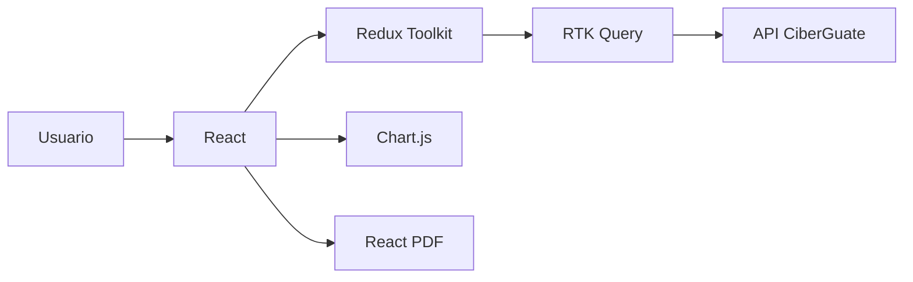

# Documentación del Frontend

| Documento | Contenido |
| --- | --- |
| [Arquitectura](architecture.md) | Capas, componentes y dependencias |
| [Rutas y casos de uso](routes-and-use-cases.md) | Navegación, actores y flujos |
| [Estado global](state-management.md) | Redux Toolkit, RTK Query y sesión |
| [Dashboards y reportes](reporting.md) | Chart.js, React PDF y trazabilidad |
| [Desarrollo](development.md) | Entorno local, Docker y CI/CD |
| [Seguridad](security.md) | Controles del cliente web |

El frontend presenta y captura información; el backend realiza la evaluación, persistencia y autorización definitiva.

