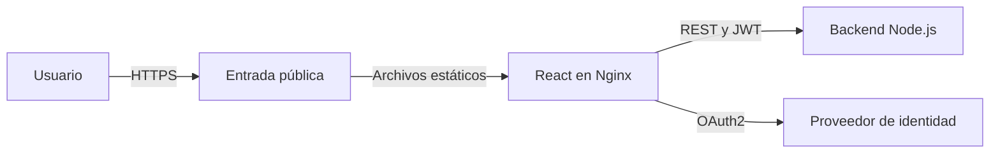
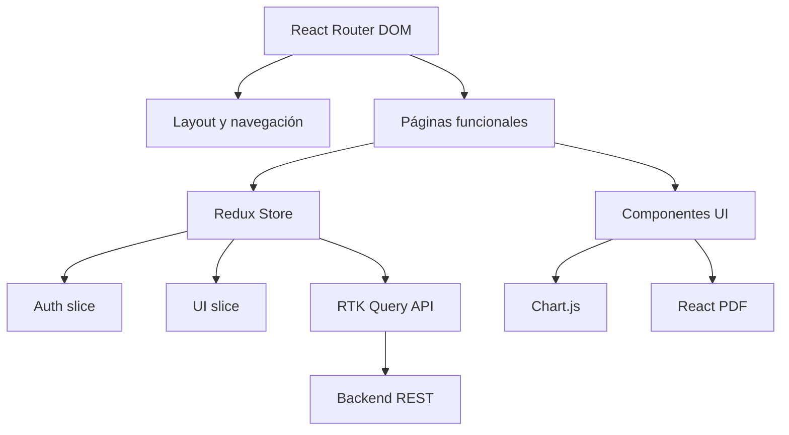
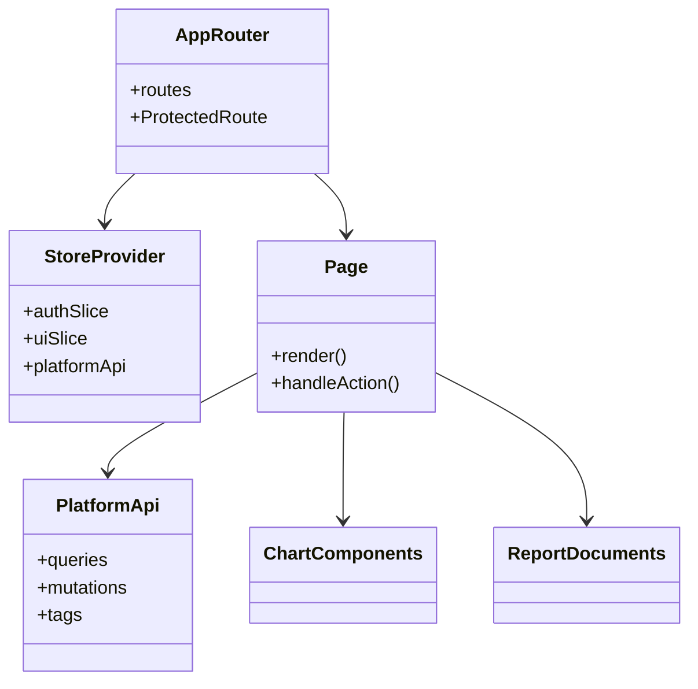

# Arquitectura del Frontend

## Vista de contenedores

## Capas internas

| Capa | Responsabilidad |
| --- | --- |
| Router | Resolver URL, retorno posterior al login y protección de rutas |
| Páginas | Orquestar cada capacidad y estados de carga/error |
| Store | Compartir sesión, interfaz y caché de datos |
| RTK Query | Consultas, mutaciones, etiquetas y errores HTTP |
| Componentes | Presentación reutilizable, gráficas y documentos |

## Diagrama de componentes

## Decisiones

- La URL es la fuente de verdad de la sección activa y permite enlaces directos.
- Redux conserva estado transversal; los datos remotos viven en RTK Query.
- Gráficas y reportes se derivan de la API, no de datos simulados.
- Cada resultado presenta fecha, alcance y detalle verificable.
