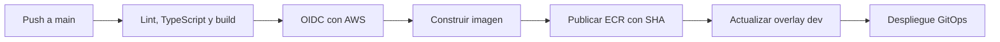

# Desarrollo, Docker y CI/CD

## Requisitos

- Node.js 22 y npm.
- Backend accesible o el entorno completo mediante Docker Compose desde GitOps.

## Ejecución local

```bash
npm ci
npm run dev
```

Use las variables admitidas por el proyecto para apuntar al backend. En despliegue, Nginx sirve el contenido y enruta las solicitudes previstas por la configuración del contenedor.

## Calidad

```bash
npm run lint
npx tsc --noEmit
npm run build
npm audit --audit-level=high
```

## Imagen

```bash
docker build -t ciberguate-frontend:local .
docker run --rm -p 3000:80 ciberguate-frontend:local
```

## Pipeline



La etiqueta inmutable debe ser el SHA completo del commit. Los secretos viven en GitHub Actions/AWS y no se incluyen en el repositorio ni en la imagen.

## Estructura relevante

```text
app/
  components/   UI, layout, gráficas y reportes
  pages/        páginas por dominio
  ciberguate-app.tsx
  store.tsx
  types.ts
.github/workflows/ci-cd.yml
Dockerfile
nginx.conf
```
