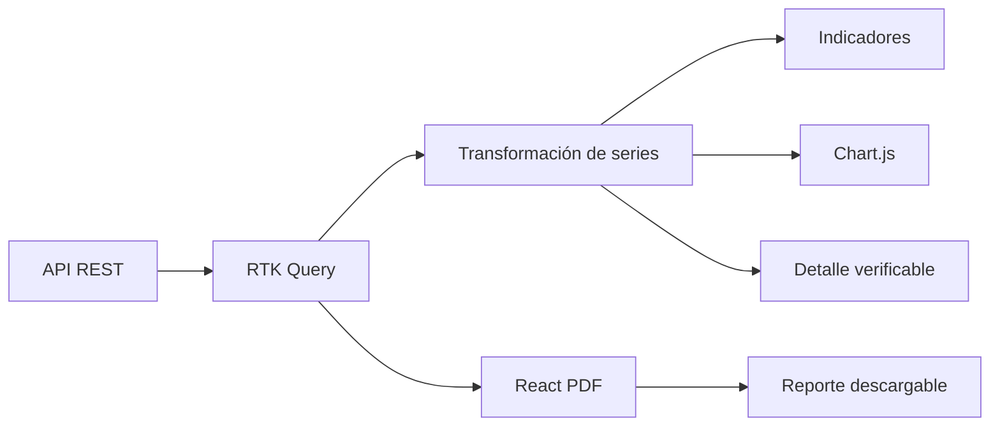
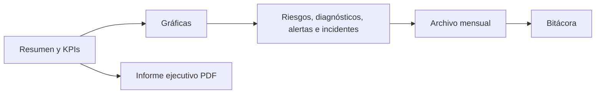

# Dashboards y reportes

## Flujo de información

## Centro de reportería

La ruta `/reports` centraliza cinco áreas navegables: resumen ejecutivo, métricas, evidencia, archivo mensual y auditoría. El dashboard general enlaza directamente a este centro.

Las gráficas usan contenedores responsivos con altura estable. Las comparaciones con etiquetas extensas se muestran horizontalmente para evitar cortes y solapamientos.

Chart.js se utiliza para distribución y tendencia; React PDF produce documentos desde los mismos resultados visibles. Las tablas de detalle permiten explicar los totales y puntajes.

## Reglas de trazabilidad

- Mostrar fecha de generación y período o alcance evaluado.
- Identificar el activo, objetivo, diagnóstico o incidente asociado.
- Acompañar puntajes con hallazgos y severidad.
- No presentar una ejecución fallida como resultado válido.
- Identificar claramente el motor analítico utilizado cuando exista una recomendación de IA.
- Los reportes mensuales persistidos por el backend tienen precedencia sobre cálculos temporales del cliente.

## Tipos de salida

| Vista | Evidencia mínima |
| --- | --- |
| Dashboard ejecutivo | KPIs, distribución, tendencia y actividad reciente |
| Diagnóstico | Objetivo, puntaje, siete o más hallazgos si corresponden, severidad y recomendación |
| Cumplimiento | Marco, control, estado, evidencia y porcentaje |
| Monitoreo | Objetivo, estado, latencia, última verificación e historial |
| Incidentes | Severidad, estado, línea temporal y acciones automatizadas |
| PDF | Título, período, resumen, detalle y fecha de generación |

El PDF ejecutivo del servidor incluye KPIs, gráficas vectoriales, detalle de riesgos, plan de tratamiento, metodología y numeración de páginas. Su composición se valida renderizando cada página antes de publicar.

## Validación visual

Verifique escalas y leyendas con datos vacíos, parciales y extensos; descargue cada PDF y confirme que no haya texto cortado y que los totales coincidan con la API.
