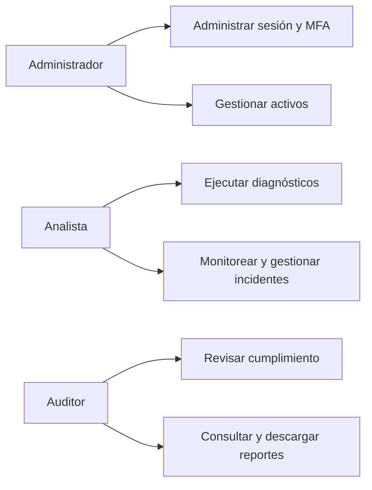
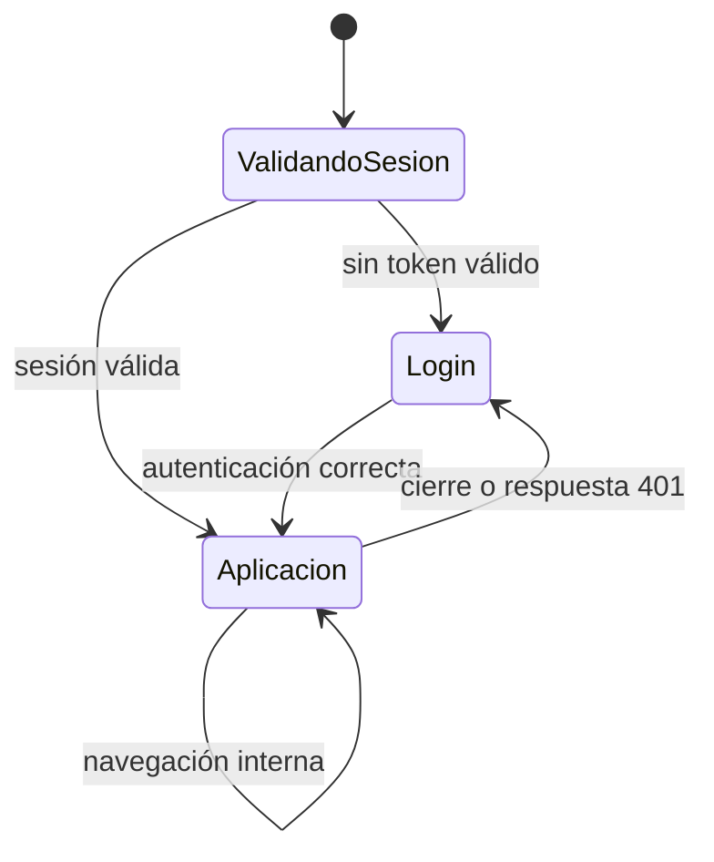
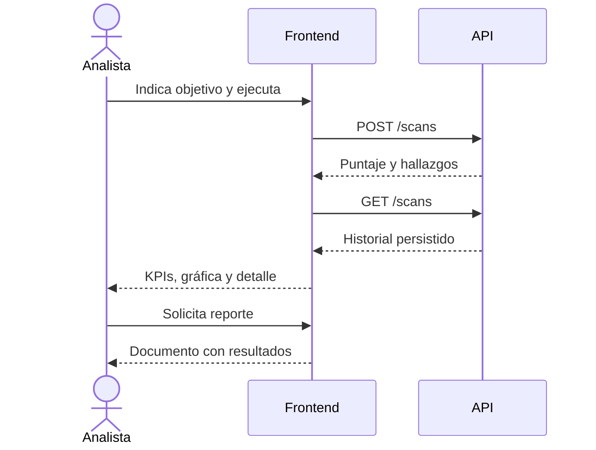

# Rutas y casos de uso

## Actores y capacidades

La autorización final depende del backend. Actualmente los usuarios autenticados comparten las capacidades funcionales disponibles.

## Mapa de navegación

| Ruta | Función | Datos |
| --- | --- | --- |
| `/login`, `/oauth/callback` | Autenticación | Sesión y token |
| `/dashboard` | Resumen ejecutivo | KPIs, riesgos, actividad |
| `/assets` | Inventario | Activos |
| `/risks` | Evaluación | Riesgos |
| `/diagnostics` | Ejecuciones y hallazgos | Escaneos |
| `/monitoring`, `/alerts` | Disponibilidad y alertas | Monitores |
| `/compliance` | NIST/ISO | Controles |
| `/documents` | Evidencia | Documentos |
| `/soc`, `/incidents` | Operación y respuesta | Eventos e incidentes |
| `/reports` | Historial y PDF | Reportes |
| `/plans`, `/security` | Oferta y configuración | Seguridad |

## Diagnóstico y evidencia

Toda mutación muestra progreso, éxito o error; los estados vacíos indican cómo generar información y cada KPI conserva acceso a su evidencia.
