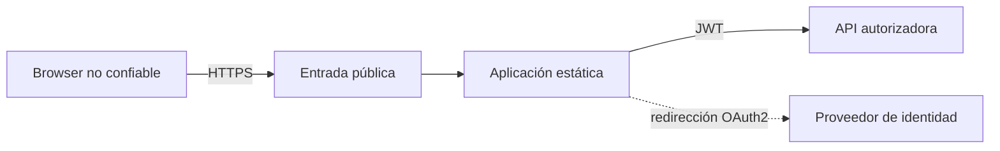
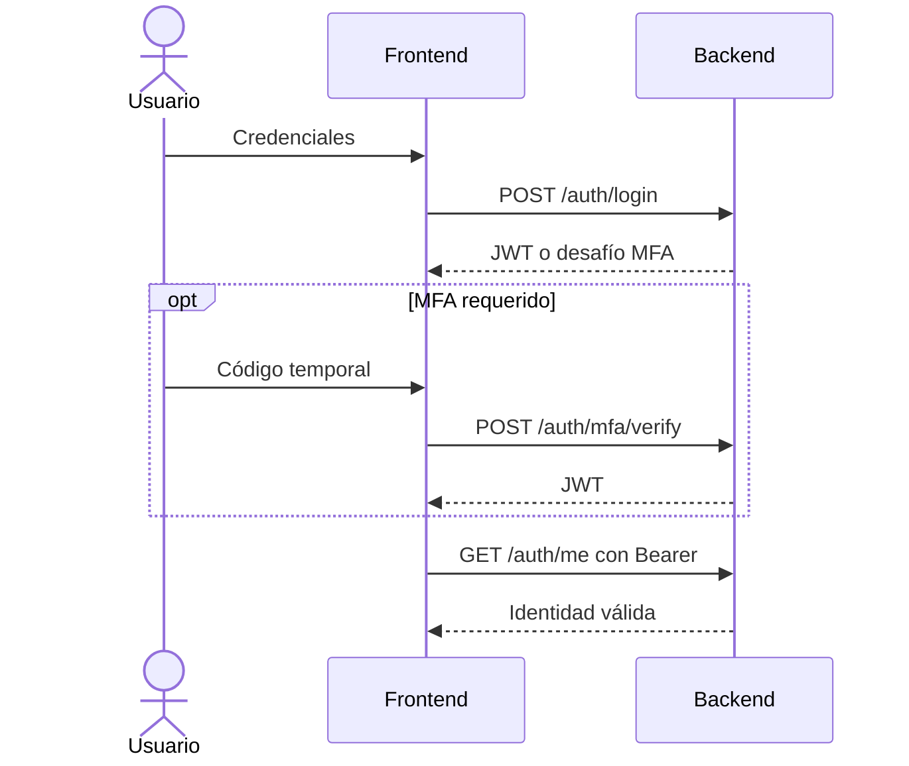

# Seguridad del Frontend

## Límites de confianza

El navegador nunca se considera una autoridad. Ocultar un botón mejora la experiencia, pero sólo el backend puede autorizar una operación.

## Controles

| Riesgo | Control |
| --- | --- |
| Exposición persistente del token | Uso de `sessionStorage`, cierre explícito y ausencia en logs |
| Acceso sin sesión | Rutas protegidas y validación de `/auth/me` |
| Sesión expirada | Manejo de 401 y retorno al login |
| Inyección en la interfaz | Renderizado escapado de React; evitar HTML arbitrario |
| Dependencias vulnerables | Lockfile, auditoría y compilación en CI |
| Datos engañosos | Estados de error explícitos y evidencia junto a KPIs |
| Transporte inseguro | HTTPS en el punto de entrada público |

## Autenticación

No documente contraseñas, tokens, claves OAuth ni valores de Kubernetes Secret. Los archivos `.env` locales deben permanecer fuera del control de versiones.
