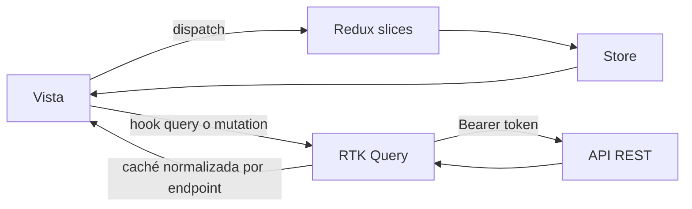
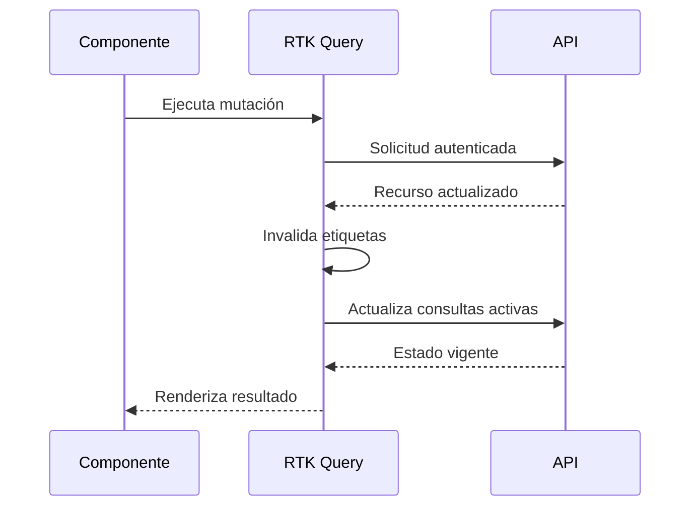

# Estado global y acceso a datos

## Diseño

| Módulo | Contenido | Persistencia |
| --- | --- | --- |
| `authSlice` | Token, usuario y estado de autenticación | `sessionStorage` |
| `uiSlice` | Preferencias transversales de interfaz | Memoria |
| `platformApi` | Consultas, mutaciones y caché de API | Memoria |

El token se conserva durante la sesión del navegador, no de forma permanente. `prepareHeaders` lo agrega como `Authorization: Bearer` a las solicitudes protegidas.

## Ciclo de mutación

## Convenciones

- Estado local para formularios temporales; Redux sólo para datos compartidos.
- No duplicar respuestas de RTK Query dentro de slices.
- Usar etiquetas específicas para evitar recargar módulos no relacionados.
- Representar explícitamente `isLoading`, `isFetching`, `error` y estado vacío.
- Cerrar la sesión ante credenciales inválidas y evitar registrar el token.
